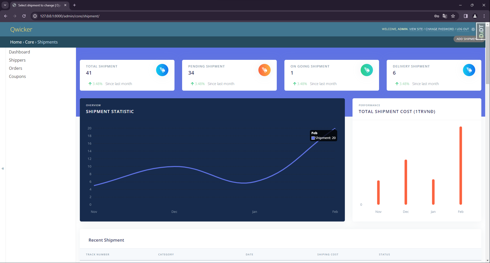
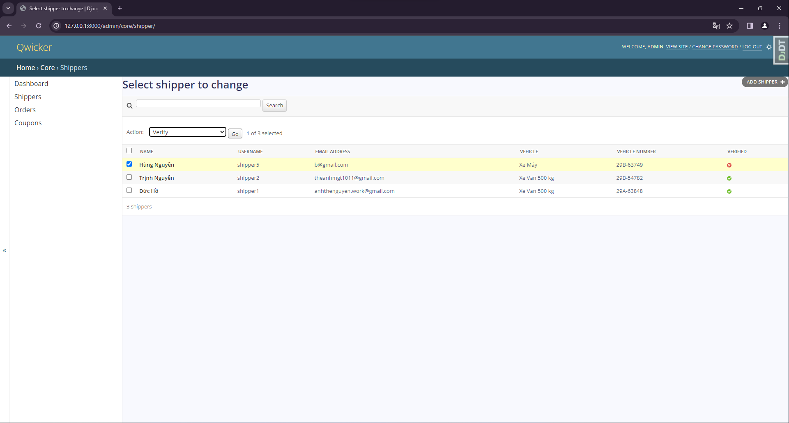

<a href="https://docs.djangoproject.com/en/5.0/"> </a>
<a href="https://www.mysql.com/"> </a>
<a href="https://www.mysql.com/"> </a>
<a href="https://redis.io/"> </a>
<a href="https://docs.celeryq.dev/en/stable/django/first-steps-with-django.html"> </a>
<a href="https://www.docker.com/"> </a>

# Qwicker Backend

Qwicker backend is a comprehensive RESTful API backend designed to support applications for fast item delivery services, similar to Lalamove. Qwicker is a powerful Django-based RESTful API backend designed to support applications for fast item delivery services, similar to Lalamove. Qwicker offers a wide range of features including user management, job registration, auction systems, system administration, and detailed data analytics

For a comprehensive user interface to interact with the Qwicker backend, check out my React Native client application repository [here](https://github.com/Theanhmgt/qwicker-reactnative-frontend).<br>
For a comprehensive demo, you can watch the full video on YouTube by clicking on the link provided [here](https://www.youtube.com/watch?v=GISC5GFzDdM).

## Table of contents

- 🏛️[Architecture diagram](#🏛️architecture-diagram)
- 🏛️[Database schema diagram](#🏛️database-schema-diagram)
- 🛠️[Prerequisites](#🛠️prerequisites)
- 🚀[Getting Started](#🚀getting-started)
- 📊[Admin Interface](#📊admin-interface)
- 🔧[Configure Environment Variables](#🔧configure-environment-variables-not-needed-for-basic-project-execution)
- 🔗[References](#🔗references)
- 📧[Contact](#📧contact)

## Tasks

- **User Management**: Users can log in with roles such as admin, shipper, and regular user.
- **User and Shipper Registration**: Users and shippers can register accounts, with shippers required to provide an avatar and identification information. Shipper accounts need to be confirmed by the admin.
- **Admin Management**: Admins can add, delete, and update shipper information and promotional services. Admins can also view lists of pending shipping orders without assigned shippers.
- **Shipper Information Viewing**: Users can view shipper profiles and details, including community ratings.
- **Item Posting**: Users can post items they want to ship, and shippers can bid to secure the delivery rights.
- **Auction and Shipper Selection**: Users choose shippers through auctions, with only the owner of the post seeing the auction details. When a shipper is selected, the system automatically sends notification emails to the chosen shipper and rejection emails to other bidders.
- **Rating and Commenting**: Users can rate and comment on shippers within the system.
- **Order Recording and Notification**: Shippers can record completed shipping orders, triggering email notifications to customers.
- **Online Payment with VNPay**: Users can make online payments through VNPay, providing a convenient and secure payment method.
- **System Administration**: Admins can view order information and use various search methods by date, product, and generate charts for delivery frequency and revenue.

## 🏛️Architecture diagram


## 🏛️Database schema diagram


## 🛠️Prerequisites

What you need to run the project:

- [Docker](https://www.docker.com/) - Install Docker to run the project locally without the need to install additional dependencies.
  Run without docker:
- [Postman](https://www.postman.com/) - Install Postman to interact with the API endpoints.

## 🚀Getting Started

After installing Docker, run the following commands to start experiencing this project:

```shell
# download the project
git clone https://github.com/Theanhmgt/qwicker-django-backend.git
cd qwicker-django-backend
# build container
docker compose build
# run container
docker compose up
```

At this time, you have a RESTful API server running at http://127.0.0.1:8000 or accessing the Swagger UI for interactive API documentation by navigating to http://127.0.0.1:8000/swagger.

```shell
# authenticate the user via: POST /auth/token/
curl -X POST -H "Content-Type: application/json" -d '{"username": "theanh1", "password": "Theanh28", "grant_type": "password"}' http://localhost:8000/auth/token/
# should return a token like: { "access_token": "...access token here...","refresh_token": "...refresh token here..."}
# with the above token, access the album resources, such as: GET /jobs/
curl -X GET -H "Authorization: Bearer ...access token here..." http://localhost:8000/jobs/
# should return a list of posting job in the JSON format
```

## 🏠User Interface

</img>
</img>
</img>
</img>
</img>
</img>
</img>
</img>
</img>
</img>
</img>
</img>

## 📊Admin Interface

Access the admin page by visit to http://127.0.0.1:8000/admin/ and logging in with the username `admin` and password `theanh28` to perform system management functions and data analysis
</img>
</img>

## 🔧Configure Environment Variables (Not needed for basic project execution.)

To utilize all features of the project, including sending emails and online payments, make sure to set up all necessary environment variables in the `.env` file in the root directory of the project. Refer to the project documentation for guidance on setting up these variables.

📩 Gmail smtp config:<br>
`EMAIL_BACKEND`: 'django.core.mail.backends.smtp.EmailBackend' <br>
`EMAIL_HOST`: Hostname for the SMTP server (e.g., 'smtp.gmail.com').. <br>
`EMAIL_PORT`: Port number of the SMTP server (e.g., 587 for TLS).. <br>
`EMAIL_HOST_USER`: Username for the SMTP server (e.g., abc@gmail.com)..<br>
`EMAIL_HOST_PASSWORD`: Password for the SMTP server.<br>
`DEFAULT_FROM_EMAIL`: Default sender email address for outgoing emails (e.g., 'THEANH MGT | TheCodeSpace <abc@gmail.com>')..

To obtain `EMAIL_HOST_PASSWORD` variable, following this [post](https://itsupport.umd.edu/itsupport?id=kb_article_view&sysparm_article=KB0015112).

💳VNPay config: <br>
`VNPAY_TMN_CODE` = TMN code for the VNPay API <br>
`VNPAY_HASH_SECRET_KEY` = Secret key for hashing data when communicating with VNPAY <br>
`VNPAY_PAYMENT_URL` = 'https://sandbox.vnpayment.vn/paymentv2/vpcpay.html' <br>
`VNPAY_RETURN_URL` = 'http://127.0.0.1:8000/vnpay/payment_return/' <br>

Register [here](https://sandbox.vnpayment.vn/devreg) to receive a detailed email, sandbox account, and essential keys.

## 🔗References

Here are some helpful resources and references for further information:

- [Django Documentation](https://docs.djangoproject.com/en/5.0/)
- [Django Rest Framework Documentation](https://www.django-rest-framework.org/)
- [Docker Documentation](https://docs.docker.com/)

## 📧Contact

Don't hesitate to contact me if you have any confusion or questions
<a href="https://anhthenguyen.work@gmail.com" target="blank">

</a>
<a href="http://www.linkedin.com/in/anhthenguyen204/" target="blank">

</a>

<a href="#qwicker-backend" style="transition: all .25s ease-in-out; position: fixed; bottom: 0; right: 0; display: inline-flex; cursor: pointer; align-items: center; justify-content: center; margin: 0 2em 2em 0; padding: .25em; width: 8em; height: 2em;">
  🔼 Back to top
</a>
